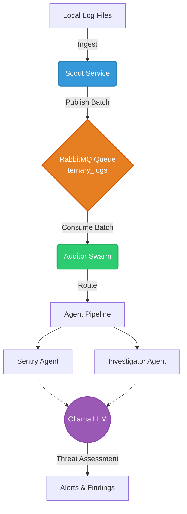

<div align="center">

# 🛡️ Aegis Connect

[](https://www.python.org/downloads/)
[](https://www.rabbitmq.com/)
[](https://ollama.ai/)
[](https://opensource.org/licenses/MIT)

**Aegis Connect is a robust, multi-agent log analysis and threat detection system.**
It leverages a high-throughput publish-subscribe architecture paired with local Large Language Models (LLMs) to automatically ingest, process, and analyze system logs for potential security threats in real-time.

</div>

---

## 📑 Table of Contents

- [Features](#-features)
- [Architecture](#-architecture)
- [Project Structure](#-project-structure)
- [Prerequisites](#-prerequisites)
- [Getting Started](#-getting-started)
  - [1. Environment Configuration](#1-environment-configuration)
  - [2. Start Infrastructure](#2-start-infrastructure)
  - [3. Run the Auditor Swarm](#3-run-the-auditor-swarm)
  - [4. Run the Scout Service](#4-run-the-scout-service)
- [Testing & Mock Logs](#-testing--mock-logs)

---

## ✨ Features

- **Microservice Architecture**: Decoupled ingestion and analysis pipelines ensuring high scalability.
- **Real-time Ingestion**: Continuous monitoring and batching of local log files.
- **AI-Driven Analysis**: Utilizes local LLMs (via Ollama) to parse complex log structures and identify anomalies.
- **Multi-Agent Pipeline**: Dedicated "Sentry" and "Investigator" agents handle different stages of log assessment.
- **Secure & Private**: All data processing and AI inference happen locally, ensuring sensitive logs never leave your infrastructure.

---

## 🏗️ Architecture

Aegis Connect operates through two primary microservices that communicate asynchronously via RabbitMQ.



### 1. Scout Service (`scout-service`)
The frontline ingestion pipeline. It continuously monitors designated log files, chunks new entries into batches, and securely publishes these payloads to the RabbitMQ exchange.

### 2. Auditor Swarm (`auditor-swarm`)
The core analysis engine. It subscribes to the log queue and routes incoming data through an intelligent orchestrator. AI agents (like the Sentry and Investigator) consult a local LLM to flag reconnaissance attempts, unauthorized access, or other suspicious patterns.

---

## 📂 Project Structure

```text
Aegis_connect/
├── auditor-swarm/            # Log analysis microservice
│   ├── agents/               # Sentry and Investigator AI agents
│   ├── config/               # Configuration management
│   ├── engine/               # Orchestrator and agent pipeline logic
│   ├── messaging/            # RabbitMQ consumer logic
│   ├── main.py               # Entry point for auditor swarm
│   └── pyproject.toml        # Dependencies for auditor swarm
├── scout-service/            # Log ingestion microservice
│   ├── main.py               # Entry point for scout service
│   ├── Publisher.py          # RabbitMQ publishing utility
│   ├── TestFileGenerator.py  # Mock log generator for testing
│   └── logfiles.log          # Default target log file
├── .env                      # Global environment configuration
└── README.md                 # Project documentation
```

---

## 🛠️ Prerequisites

Before you begin, ensure you have the following installed on your system:

- **Python 3.12+**
- **RabbitMQ**: Running locally or accessible via network.
- **Ollama**: Installed and serving your preferred LLM for analysis (e.g., `llama3`, `mistral`).

---

## 🚀 Getting Started

Follow these steps to deploy Aegis Connect locally.

### 1. Environment Configuration

Aegis Connect relies on environment variables for seamless operation across both microservices. Ensure you have a `.env` file in the project root:

```env
# RabbitMQ Configuration
RABBITMQ_HOST=localhost

# Scout Service Configuration
LOGFILE_NAME=logfiles.log

# Auditor Swarm Configuration
OLLAMA_URL=http://localhost:11434/api/generate
```

### 2. Start Infrastructure

Ensure your foundational services are up and running:
1. **RabbitMQ**: Start your RabbitMQ server.
2. **Ollama**: Start the Ollama service and ensure the model is pulled (`ollama run <model_name>`).

### 3. Run the Auditor Swarm

Start the analysis engine to begin listening for incoming logs.

```bash
cd auditor-swarm
# Install dependencies via pip or poetry
pip install -r requirements.txt # Or appropriate command based on pyproject.toml
python main.py
```
*You should see logs indicating a successful connection to RabbitMQ and the queue.*

### 4. Run the Scout Service

Open a **new terminal window** and start the ingestion pipeline.

```bash
cd scout-service
# Install dependencies
pip install pika
python main.py
```
*The service will start tailing `logfiles.log` and streaming batches to the Auditor Swarm.*

---

## 🧪 Testing & Mock Logs

If you need to generate test data to see Aegis Connect in action, you can use the built-in mock log generator.

While inside the `scout-service` directory, run:

```bash
python TestFileGenerator.py
```

This will automatically populate `logfiles.log` with realistic system events, simulating potential threats that the Auditor Swarm will immediately begin analyzing.
